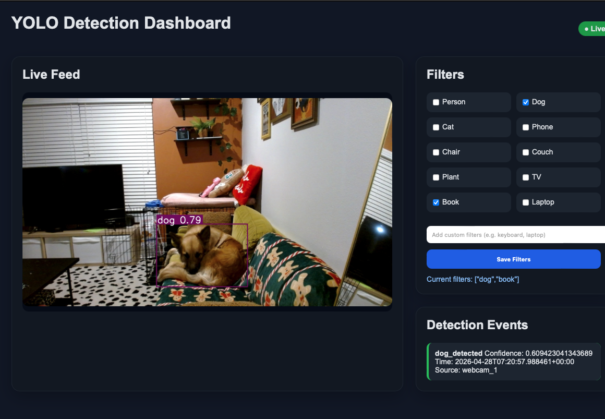

# IoT_VSaaS
IoT VSaaS Real-Time Video Analytics Platform
Built an edge video analytics pipeline that captures live camera frames with OpenCV, performs object detection using Ultralytics YOLOv8, serves video and event APIs through Flask, and publishes detection events to Confluent Kafka for downstream consumers and alerting workflows. Implemented class-based detection filtering, confidence thresholds, and cooldown-based event debouncing to control event quality and stream volume.

Architecture: OpenCV Camera Ingest → YOLOv8 Inference → Flask Backend (API + Streaming) → Confluent Kafka Event Stream → Flask HTML/CSS Dashboard



## Current App Flow

1. `app/webcam.py` opens webcam `0` with OpenCV and reads frames in a loop.  
2. Each frame is passed to Ultralytics YOLOv8 (`yolov8n.pt` by default, override via `YOLO_MODEL_PATH`).  
3. Detections are normalized into objects with class name, normalized class name, confidence, and bounding box.  
4. Active filter classes are loaded from the UI-backed config (`load_filter_classes`) and applied via `filter_detections`.  
5. Filtered detections are drawn on the frame, and the latest frame is written to `app/latest_frame.jpg` for Flask streaming.  
6. Event gate logic runs per detection:
   - class must be `dog`
   - confidence must be `>= 0.5`
   - cooldown must pass (`COOLDOWN_SECONDS = 3`)  
7. When the gate passes, `send_event(confidence)` publishes a JSON event to Kafka topic `detections` (default).  
8. `app/app.py` serves:
   - `/video_feed` for MJPEG live stream
   - `/events` for recent detection events
   - `/filters` to read/update class filters from the dashboard  
9. The Flask HTML/CSS dashboard polls events and renders live feed + filter controls in real time.

## Known issue (macOS + external monitors)

When running via OpenCV `cv2.imshow` on macOS, moving the preview window to a different/extended monitor may cause the preview window to disappear while the terminal process keeps running.

Current workaround:
- Keep the OpenCV preview window on the same display where it was first opened.
- If the window disappears, stop and restart the script.

## Kafka Setup & Viewing Detection Events

### Prerequisites

- Local setup: Kafka installed on host, broker at `localhost:9092`
- Docker setup: Kafka running in container, broker reachable as `kafka:9092` inside Docker network

### 1. Start Kafka (KRaft Mode)

#### Local

```bash
bin/kafka-server-start.sh config/kraft/server.properties
```

#### Docker

Start your Kafka container/stack using your Docker setup (for example `docker compose up -d`).

For both setups, wait until Kafka logs indicate the server started:

```text
KafkaServer ... started
```

### 2. Verify Kafka is Running

#### Local

```bash
bin/kafka-topics.sh \
  --bootstrap-server localhost:9092 \
  --list
```

#### Docker

```bash
docker ps
```

Confirm your Kafka container name (example: `kafka-docker-kafka-1`), then verify topic access:

```bash
docker exec -it kafka-docker-kafka-1 /opt/kafka/bin/kafka-topics.sh \
  --bootstrap-server kafka:9092 \
  --list
```

If Kafka is running, commands return (may be empty). If not, you’ll see a connection error.

### 3. Create the Topic (First Time Only)

#### Local

```bash
bin/kafka-topics.sh \
  --bootstrap-server localhost:9092 \
  --create \
  --topic detections \
  --partitions 1 \
  --replication-factor 1
```

#### Docker

```bash
docker exec -it kafka-docker-kafka-1 /opt/kafka/bin/kafka-topics.sh \
  --bootstrap-server kafka:9092 \
  --create \
  --topic detections \
  --partitions 1 \
  --replication-factor 1
```

### 4. Run the Webcam Detection Script

Start your Python script:

```bash
python app/webcam.py
```

Optional environment overrides used by `app/kafka_producer.py`:

```bash
KAFKA_BOOTSTRAP_SERVERS=localhost:9092
KAFKA_TOPIC=detections
KAFKA_SOURCE=webcam_1
```

When a dog is detected, events will be sent to Kafka.

### 5. View Detection Events (Kafka Consumer)

#### Local

```bash
bin/kafka-console-consumer.sh \
  --bootstrap-server localhost:9092 \
  --topic detections \
  --from-beginning
```

#### Docker

```bash
docker exec -it kafka-docker-kafka-1 /opt/kafka/bin/kafka-console-consumer.sh \
  --bootstrap-server kafka:9092 \
  --topic detections \
  --from-beginning
```

You’ll see messages like:

```json
{"event_type":"dog_detected","confidence":0.82,"timestamp":"...","source":"webcam_1"}
```

### 6. Notes

- Remove `--from-beginning` to see only new events
- Keep the consumer running while testing
- Stop with `Ctrl + C`
- For Docker, replace `kafka-docker-kafka-1` with your actual container name from `docker ps`
- If you set `KAFKA_TOPIC`, use the same topic name in the consumer commands above

### Troubleshooting

**Error:**

```text
Connection to node -1 could not be established
```

Kafka is not running.

**Error (Docker on host machine):**

```text
Failed to resolve 'host.docker.internal:9092'
```

Kafka is advertising the wrong broker address to host clients.

What to check in your Docker Kafka config:
- `KAFKA_ADVERTISED_LISTENERS` must advertise `localhost:9092` for host tools/apps
- If you also need container-to-container traffic, keep a separate internal listener (for example `kafka:29092`)
- After editing `docker-compose.yml`, save it and recreate the stack so the new env vars are applied:

```bash
docker compose down
docker compose up -d
```

Quick verify:

```bash
kcat -b localhost:9092 -L
```

Broker metadata should show `localhost:9092`, not `host.docker.internal:9092`.

### Summary

- Webcam detects dog
- Event is sent to Kafka topic `detections`
- Consumer reads and displays events in real time
